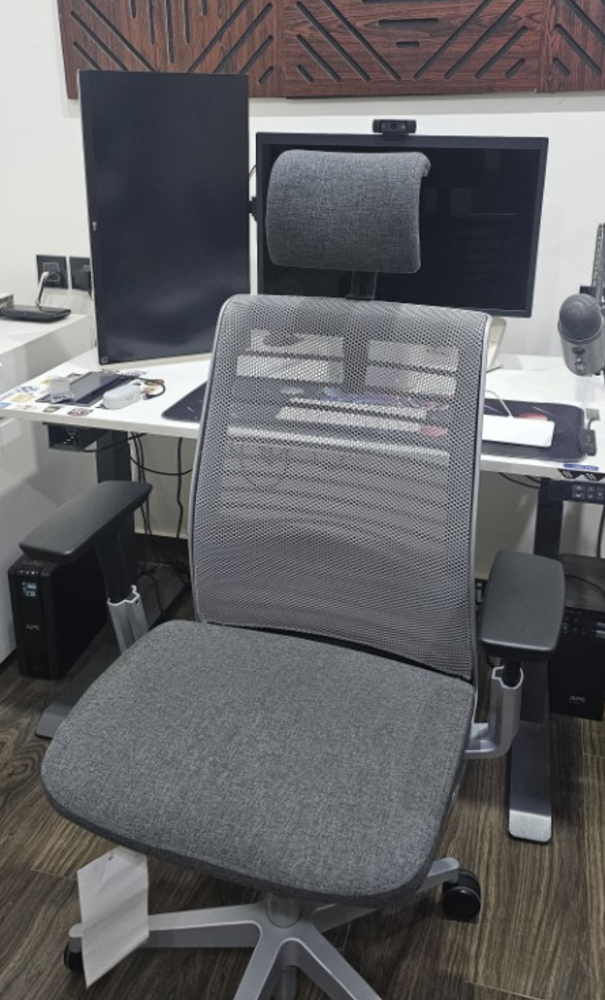

This is a living list of the hardware and software I use for work and play. Some of it is
new, and some has stayed with me for years because it still does the job well. The years
in parentheses are when I bought an item; unless noted otherwise, it is still working.

## Workstations

### Mac Studio - 2022

My main powerhouse is a Mac Studio with an Apple M1 Max: a 10-core CPU, 24-core GPU,
16-core Neural Engine, 32GB of unified memory, and 1TB of SSD storage.

### MacBook Air - 2026

My other computer is a MacBook Air with an Apple M5, a 10-core CPU, 10-core GPU, and 32GB
of unified memory. I use it whenever I am on the go.

## Monitors

- [LG 27MD5KL-B 27-inch UltraFine 5K](https://www.amazon.in/dp/B07XV9NQSJ?ref_=ppx_hzsearch_conn_dt_b_fed_asin_title_5)
  with macOS compatibility (2022). I bought this alongside the Mac Studio. It is a good
  monitor, but I do not think it lives up to the price or the hype.
- [LG 27UK650 27-inch 4K UHD IPS monitor](https://www.amazon.in/dp/B078GRM2MV?ref_=ppx_hzsearch_conn_dt_b_fed_asin_title_8)
  with HDR10 (2018). I use this one in portrait mode.
- [AmazonBasics height-adjustable dual-monitor arm](https://www.amazon.in/dp/B076B3Q8JR?ref_=ppx_hzsearch_conn_dt_b_fed_asin_title_5)
  (2022).

## Desk Setup

- [Steelcase Think Carbon Neutral chair](https://in.steelcase.com/products/think-carbonneutral?variant=46417628168342)
- [EBCO Smart Lift Pro](https://ebco.in/worksmart/smart-lift-pro-2-3-stage-anti-collision-3-memory-setting),
  a three-stage sit-stand desk with anti-collision and three memory settings
- A custom-made tabletop from a local carpenter
- An EBCO electrical panel retrofitted into the desk

## Peripherals

- Apple Magic Keyboard and Magic Trackpad
- Blue Yeti microphone (2018)
- Logitech C920 webcam (2019)

## Gaming PC

I built this PC because I wanted to play a lot of games. In reality, I hardly find the
time for it 😅.

The setup includes:

- [Acer Nitro XV272U V3 27-inch WQHD gaming monitor](https://www.amazon.in/dp/B0CCSL95T1?ref_=ppx_hzsearch_conn_dt_b_fed_asin_title_4)
  with a 180Hz refresh rate and HDR400—a gift from Freemius (2025)
- [Logitech MX Master 2S wireless mouse](https://www.amazon.in/dp/B071YZJ1G1?ref_=ppx_hzsearch_conn_dt_b_fed_asin_title_3)
  (2021)
- Logitech G29 racing wheel (2024) - Bought from a local shop.

The PC itself has:

- AMD Ryzen 5 7600X
- MSI B650M Gaming Plus WiFi DDR5 motherboard
- Antec G750 750W 80 Plus Gold semi-modular power supply
- Sapphire Radeon RX 7800 XT Nitro+ with 16GB GDDR6
- Samsung 1TB 990 EVO Plus NVMe Gen4 SSD
- ADATA XPG Lancer Blade RGB 32GB (2×16GB) DDR5-6000 memory
- Cooler Master Hyper 212 ARGB Halo Black cooler
- Ant Esports Crystal X7 ARGB Black case

## Backups

I use Google Drive for backups, with OneDrive as a redundant copy.

## Browsers

Google Chrome is my main browser. I keep Safari and Firefox around for testing only.

## Software

- [PhpStorm](https://www.jetbrains.com/phpstorm/) for company work
- [Visual Studio Code](https://code.visualstudio.com/) for personal work and a few
  Freemius projects
- [Figma](https://www.figma.com/) for design
- [iTerm2](https://iterm2.com/), still my favorite terminal after many years. I find newer
  terminals such as Ghostty more hype-driven than practical for how I work.
- [Dracula PRO](https://draculatheme.com/pro), the premium color scheme I bought and now
  use everywhere. I am a big fan.
- [Dank Mono](https://dank.sh/) as my coding font
- [MAMP PRO](https://www.mamp.info/en/mamp-pro/) and [ServBay](https://www.servbay.com/)
  for local development servers
- [Magnet](https://magnet.crowdcafe.com/) for window management. I still use it after all
  these years.
