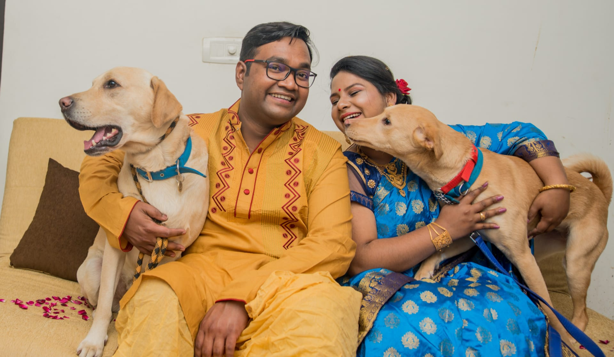
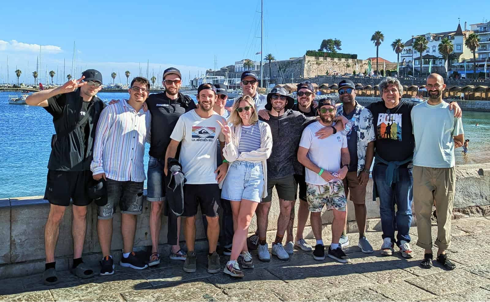
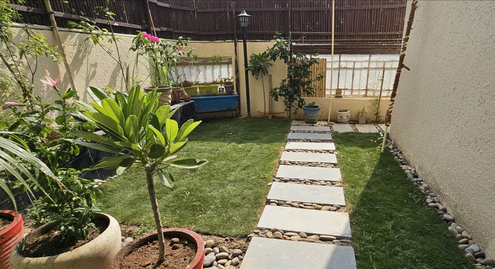

Wow! I can't believe it's been seven years since I last wrote a blog post. It's refreshing
to see that it was about fixing some obscure error in
[GitLab CI](./fix-yarn-error-137-on-gitlab-ci.mdx). It just reassures me that the fun in
engineering is still the same as it has been. We hit a wall and we bang our heads until we
figure it out 😉

Nowadays, I guess we could just ask AI. As I'm writing this, AI is constantly trying to
suggest what I should write next. Funny how I am just typing faster so it can't suggest
anything, instead of simply disabling it.

Anyway, looks like I'm drifting too far. I don't dislike AI. In fact, I love it. Because
of AI, I was able to spin up this blog really fast. Perhaps it took me about 8-10 hours of
focused work, and in that time we (me and AI):

- Migrated the site from Gatsby to Astro
- Created and implemented a new design
- Hooked it up with Netlify deployment

Really, really amazing work.

While a lot happened this year, I don't feel like writing about everything. I will just
stick to the highlights:

## Getting Married

Yep, the biggest highlight so far: we got married. I am ever thankful to my lovely wife
for choosing to stick with me all these years.

We didn't have a big wedding. We had a very small ceremony with our close family and
friends. I think as usual, our dogs made the day brighter.

> PS: If you're wondering how come our Indian family accepted the small ceremony, well,
> that's a discussion for another day.

## Joining Freemius

The second biggest highlight is that I joined [Freemius](https://freemius.com/) as the VP
Engineering. Previously I was selling my products on the Envato marketplace. While that
worked, I always felt something was missing. I am a builder by heart, not really a
marketer. With the decline of the popularity of the marketplace, it became clear that I
needed to move on.

As it happened, I was working on the next version of my plugin (which I will release
someday 🤞) and I was looking for other platforms to sell on. Freemius turned out to be
the best. I got in touch with the CEO Vova and we had a great conversation.

I admired his vision and energy and kind of naturally wanted to be a part of it. So I just
threw a question, "are you guys hiring?" and a few weeks later, I was on board.

It's been 4 years since I joined and the time has been amazing. Together we solve some
real engineering problems, with an amazing team. There have been many challenges, and the
world of monetization never stops surprising me. But honestly it feels like I am in the
right place. The feeling of solving a problem that immediately affects thousands of makers
and customers is just amazing, can't put it in words.

## What it Means for My Business?

Sadly, abandoned! I am enjoying my new role and the challenges it brings. I do want to
keep on working on small side projects, but honestly I don't want to get back to the
hustle of running a business. Again, I am a builder, not a marketer, and doing both is
very exhausting.

I am still supporting my existing customers and will continue to do so. Right now I am
kinda vibing with the flow and going where it takes me.

## A New Apartment

We were also able to buy a new apartment. Call me old-fashioned, but I still believe that
owning a home is a great investment. Besides, I really don't like the idea of renting.
Before getting married, I was always having trouble getting a good apartment (being a
bachelor and all, and Indian uncles).

Then once we did find a good apartment, there was always the hassle of shifting every
couple of years or so. It was frustrating and exhausting.

So finally we saved enough and bought a new apartment.

I must say we are enjoying a lot here. The society is really good and we have a small
Bengali community here.

We are also celebrating Durga Puja here, which is a great thing.

Overall, life is paying off and we are enjoying it.

I must say our dogs are also enjoying the garden a lot 😁.

## Moving Forward

I am not sure what the next 7 years will bring. Let's see. But I have decided to blog
again. If you know me, then there's a chance you know about
[intechgrity](https://intechgrity.com/).

I was blogging a lot back then, but I stopped because life took over. Business, new city,
personal life, and all that.

But now I am finally feeling like life is settling down and I can focus on writing again.
But many promises have been made in the past. So no promise this time. Let's just see how
it goes.

And if you're here, still reading this, then a big THANK YOU. See you around.
