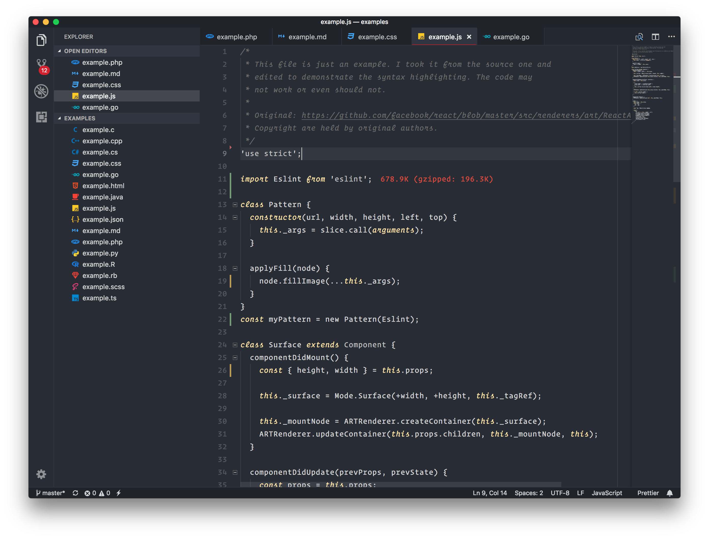
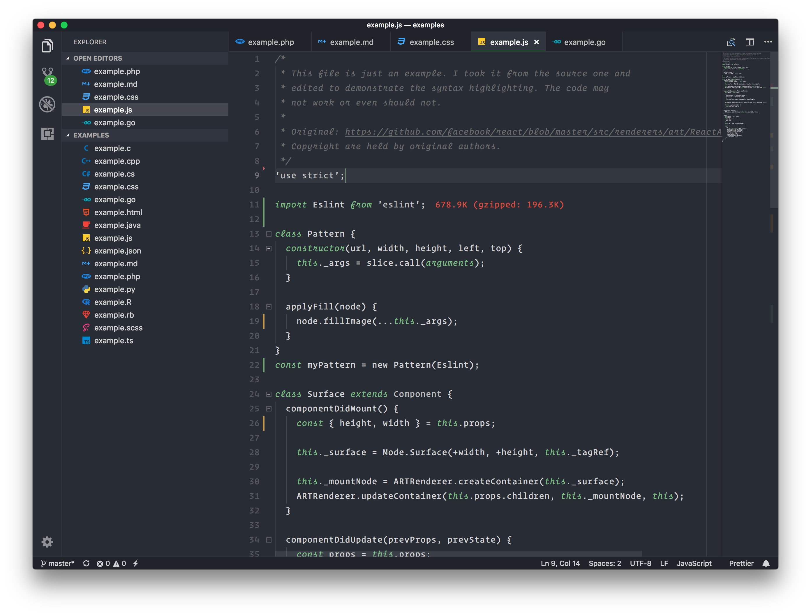
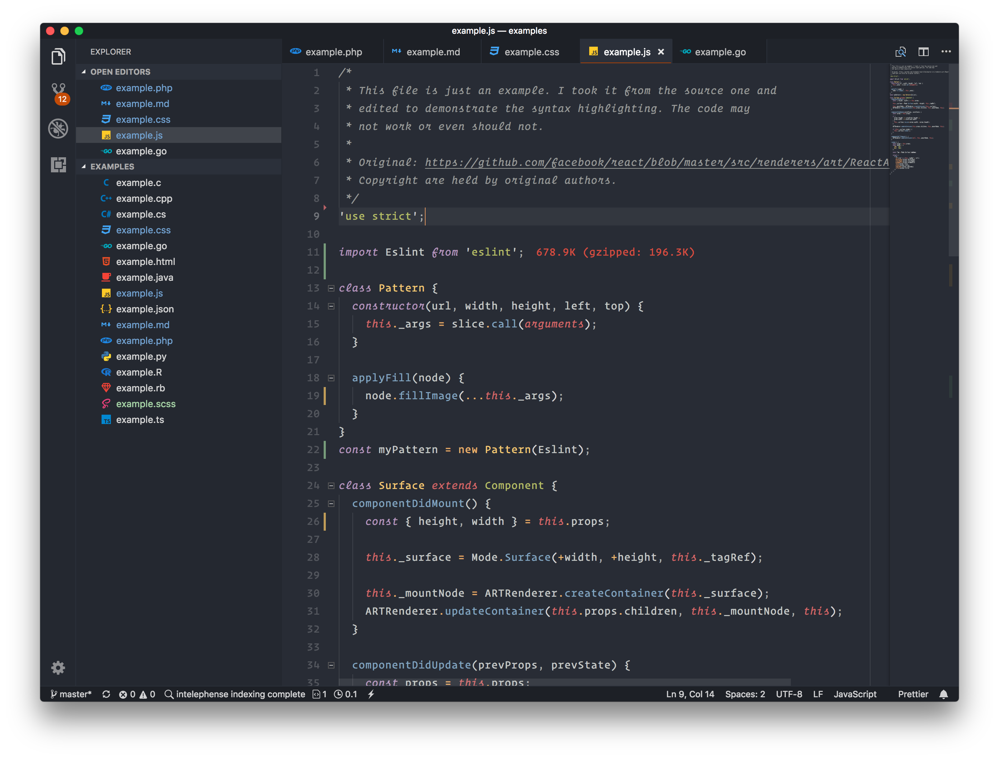

I am glad to announce [Beautiful UI](https://vscbui.rocks) 1.2 for [Visual Studio Code](https://code.visualstudio.com/).

It has 5 new color themes. 4 of them are minimal color theme inspired by [Subliminal](https://github.com/gaearon/subliminal)
from [Dan Abramov](https://github.com/gaearon). See them below.

### Minimal Yellow VSCode Color Theme

### Minimal Green VSCode Color Theme

### Minimal Purple VSCode Color Theme

### Minimal Blue VSCode Color Theme

Also I really liked the background and foreground color of the minimal themes.
So created a variation of Tomorrow Night theme. I call it **💥 Tomorrow Subliminal 💥**.

### Tomorrow Subliminal VSCode Color Theme

You can install the color themes by searching for _Beautiful UI_ from VSCode
extensions, or visiting [here](https://marketplace.visualstudio.com/items?itemName=swashata.beautiful-ui).

Let me know how you liked it.
