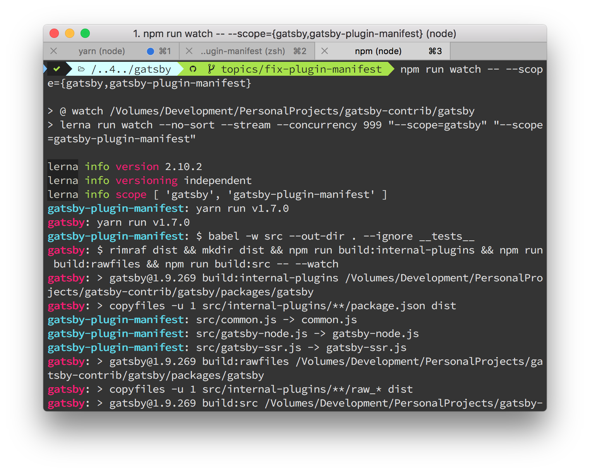
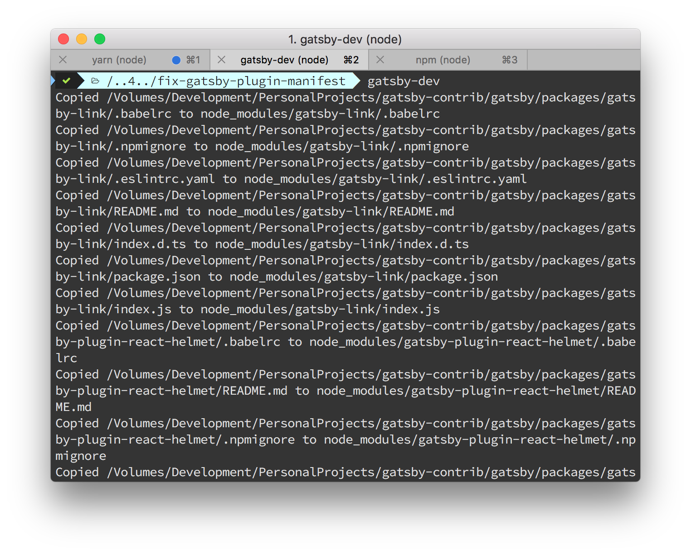

So, just now my first contribution to the awesome [Gatsbyjs](https://gatsbyjs.org)
got [merged](https://github.com/gatsbyjs/gatsby/pull/5693) and I couldn't be more excited.

The folks over there are super helpful and very responsive. It only took a few hours
for them to review and accept the MR. Awesome 💥.

So, in this post, I would like to share how I quickly setup my local environment
for contributing to one of the gatsbyjs packages. The [official docs](https://www.gatsbyjs.org/docs/how-to-contribute/#contributing-to-the-repo)
are very helpful but for the first-timers it might seem like a lot is going on.

I will try to break things down to make it as simple as possible. In fact, there
are three steps you need to follow.

## Requirements for development environment

My motivation was to enhance the [`gatsby-plugin-manifest`](https://www.gatsbyjs.org/packages/gatsby-plugin-manifest/?=manifes)
plugin to show a proper error message on failure. For this I needed to setup my
environment like this.

1.  I need to create a dummy gatsby site.
2.  I need to fork the gatsbyjs repo and work on that.
3.  Somehow I need the gatsby site I created to pull the code from my fork, instead
    of npm.
4.  Finally I would like all this to be automated. So when I change the code on my
    fork, the dummy site should get the latest compiled code from the fork.

This all seems like a lot, but surprisingly, gatsby has an automated tool to do
all of that (well not #2 of course).

## Step One: Create dummy gatsby site

This one is very straight forward. I would navigate to my home directory and
create a dummy site. Again, I am assuming you have [`gatsby-cli`](https://www.gatsbyjs.org/docs/#using-the-gatsby-cli)
installed.

```bash
cd ~
gatsby new dummy-for-fix
```

Under the hood this will use the [default starter template](https://github.com/gatsbyjs/gatsby-starter-default)
which should be more than enough for development needs.

Also it will run `yarn install` for you.

Since I want to modify the `gatsby-plugin-manifest` package, I add it too.

```bash
yarn add gatsby-plugin-manifest
```

## Step Two: Fork and Clone the gatsby repo

I am not going to say much here. You just go to [Github](https://github.com/gatsbyjs/gatsby)
fork it and clone to your computer. We will assume you are cloning inside `~/gatsby`.

Then inside the cloned fork, create a topics branch like

```bash
git checkout -b topics/fix-plugin-manifest
```

and run `yarn run bootstrap`, which will download all dependencies.

Now comes the interesting thing. We need to watch the packages we intend to change.

Gatsby's `package.json` provides a command `watch` to watch over all packages,
which could be resource intensive. So, we have options to `scope` our watch.

I was changing to the package `gatsby-plugin-manifest`, so I watched like this

```bash
npm run watch -- --scope={gatsby,gatsby-plugin-manifest}
```



Keep the terminal window open. It will now constantly watch the packages and when
changes happen, will compile on the go.

## Step Three: Use `gatsby-dev-cli` and develop

Now comes all the magic. Gatsby has provided a great tool [`gatsby-dev-cli`](https://www.gatsbyjs.org/packages/gatsby-dev-cli/)
to seamlessly automate #3 and #4 of the requirements. Install it like any NPM modules

```bash
yarn global add gatsby-dev-cli
```

and set it up for the first time by specifying the path to the cloned repository.

```bash
gatsby-dev --set-path-to-repo /Users/yourname/gatsby
```

Now open another terminal window to your **dummy-for-fix** site and run `gatsby-dev`.
What it will do is, look into the `package.json` file and replace all gatsby related
packages from official npm modules to your local modules, ones which are present
in `/Users/yourname/gatsby`.



Keep it running, because whenever we change anything in the forked repo, we would
like this tool to copy to our dummy site.

Now do your work at the fork. We are already watching it, so when we are saving
the files, the `watch` script is compiling the files and `gatsby-dev` is copying
the compiled files to our dummy site.

You can actually check the console output to see how changes made to the packages
were automatically carried over to the local dummy site.

## Publish the changes

Now do your thing, make changes, commit, make changes again, and commit that too.
Once done, just send a pull request.

I hope this excites you as much as me. If you have any doubt, feel free to ask.

PS: Just if you are wondering, I had three terminal windows open at the time of development.

1.  On `~/gatsby` (fork) with `npm run watch -- --scope={gatsby,gatsby-plugin-manifest}`.
2.  On `~/dummy-for-fix` (dummy site) with `gatsby-dev`.
3.  On `~/dummy-for-fix` (dummy site) where I would manually run `yarn build` to check if things are working.
4.  You may need one terminal on `~/dummy-for-fix` to keep on running `yarn develop`.
