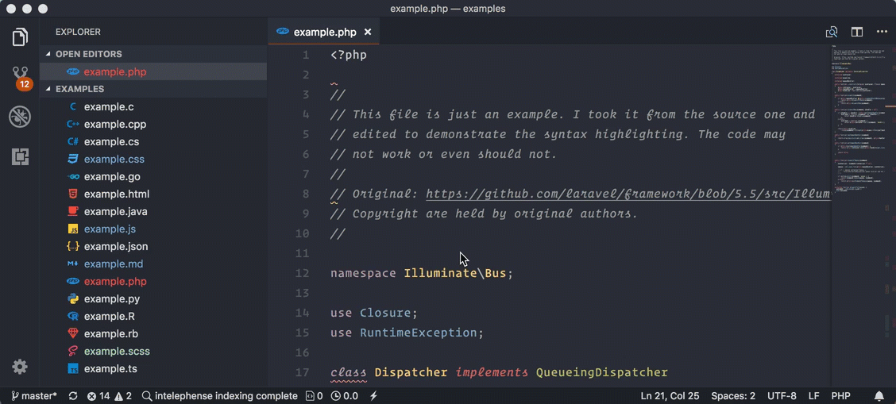

When you open a file in [Visual Studio Code](https://code.visualstudio.com/) with a single click it
by default enters in a _preview_ mode. If you do not change the file content, and
open another file, the first one will be closed and second one will replace the tab.

Of course you can just **double click** the file in the sidebar to keep it open,
but in cases when you are opening from command palette (`⌘ + t` or `⌘ + p`) having
to double click the tab to keep it open, can be really annoying.

Luckily the fix is super easy.

## Keep tabs open from Quick Open

This is when you open files from command palette.

-   Go to `Code` (`File` for Windows & Linux) > `Preferences` > `Settings`.
-   Search for `workbench.editor.enablePreviewFromQuickOpen`.
-   Set it to `false`.

## Always keep tabs open

You can also keep tabs open no matter how you do it, for example, you can single
click a file from sidebar and keep it open.

-   Go to `Code` (`File` for Windows & Linux) > `Preferences` > `Settings`.
-   Search for `workbench.editor.enablePreview`.
-   Set it to `false`.

I hope it helped. If you have any questions, shoot.
