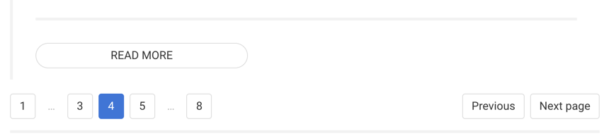
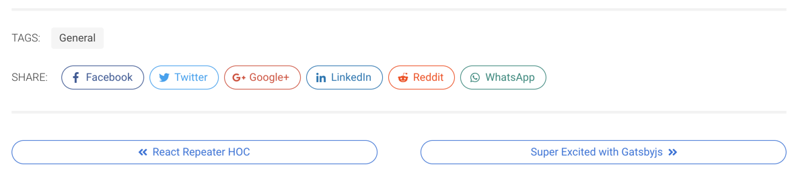

All my experiments with [Gatsbyjs](https://www.gatsbyjs.org/) has been great
so far. I did hit [a](https://github.com/gatsbyjs/gatsby/issues/5638) [few](https://github.com/AustinGreen/gatsby-starter-netlify-cms/issues/76) bumps along the road, but it was sorted out.

So this is my first tutorial on Gatsbyjs explaining something useful and practical.
I transferred by blog from hugo to gatsby and the one immediate thing I felt
missing was the blog archive page and the linked pages.

After googling around a bit, I came across this awesome plugin called
[Gatsby Pagination](https://github.com/infinitedescent/gatsby-pagination) which
solves the problem really well.

With this you can achieve two things:

1.  Create paginated blog archive page, instead of showing all your posts in a single page.
    This page can have pagination.
2.  Link to previous and next page to single blog posts.

Mind that this tutorial assumes you are familiar with gatsbyjs and react. If not,
then read the gatsby documentation, it is great. Also for the classnames of the
components are [bulma](https://bulma.io) specific.

### Installation

So first we would install the plugin.

```bash
yarn add gatsby-pagination
```

and that's it really.

### General Concept

Now we actually need to call the plugin functions within our `gatsby-node.js` to
create pages. The plugin gives us three useful functions:

1.  `createPaginationPages`: This one creates paginated archive pages.
2.  `prefixPathFormatter`: Formats the `slug` or `links` of the blog pages, like
    `http://yoursite.com/blog/`, `http://yoursite.com/blog/2/` etc.
3.  `createLinkedPages`: This will create single pages for each of your blog posts
    and will provide `prev`, `next` as pathContext to the component of your choosing.

So creating them is a two step process. First you use the APIs to pass the pagination
and link data to the component of your choosing. Next, within the component, you
do what you need to do to create a pagination UI.

### Calling the APIs from `gatsby-node.js` file

Now after using this plugin, your `gatsby-node.js` file could
export the `createPages` function like this:

```js
exports.createPages = ({ boundActionCreators, graphql }) => {
	const { createPage } = boundActionCreators;

	return graphql(`
		{
			site {
				siteMetadata {
					title
				}
			}
			posts: allMarkdownRemark(
				sort: { fields: [frontmatter___date], order: DESC }
			) {
				edges {
					node {
						id
						fields {
							slug
						}
						frontmatter {
							title
							date(formatString: "MMMM DD, YYYY")
						}
						excerpt(pruneLength: 400)
					}
				}
			}
		}
	`).then(result => {
		if (result.errors) {
			result.errors.forEach(e => console.error(e.toString()));
			return Promise.reject(result.errors);
		}

		const {
			data: {
				posts: { edges },
				site: {
					siteMetadata: { title, shortTitle },
				},
			},
		} = result;

		// Create Pagination Pages
		createPaginationPages({
			createPage,
			edges: edges,
			component: path.resolve('src/templates/BlogPage.js'),
			limit: 10,
			// pathFormatter: p => (p === 1 ? `/blog/` : `/blog/${p}`),
			pathFormatter: prefixPathFormatter('/blog'),
			context: {
				title,
				shortTitle,
			},
		});

		// Create linked blog pages
		createLinkedPages({
			createPage,
			edges: edges,
			component: path.resolve(`src/templates/blog-post.js`),
			edgeParser: edge => {
				const {
					id,
					fields: { slug },
					frontmatter: { tags },
				} = edge.node;
				return {
					path: slug,
					// additional data can be passed via context
					context: {
						id,
						slug,
					},
				};
			},
			circular: true,
		});
		return Promise.resolve();
	});
};
```

Here the `js±circular: true` is important for the `createLinkedPages`, otherwise
for some reason, it doesn't seem to work.

### Using the data in React Components

Now that we have the data, let's use them.

#### Create Paginated Blog Archive page

First let's see how the `src/templates/BlogPage.js` could look like.

```jsx
import React from 'react';
import PropTypes from 'prop-types';
import Link from 'gatsby-link';

// A custom component to actually link the blog page from excerpt
import BlogCard from '../../components/BlogCard';

// A sweet helper function to create pagination object
const createPaginationObjects = (length, page, increment = 2) =>
	Array.from({ length }, (_, i) => ({
		link: `/blog/${i + increment}/`,
		index: i + increment,
		current: page === i + increment,
	}));

// Our BlogPage Component
const BlogPage = ({ pathContext }) => {
	const {
		nodes,
		page,
		prev,
		next,
		pages,
		total,
		shortTitle: siteTitle,
	} = pathContext;

	// Create the navigation link
	let navItems = [
		{
			link: `/blog/`,
			index: 1,
			current: page === 1,
		},
	];
	if (pages <= 5) {
		navItems = [
			...navItems,
			...Array.from({ length: pages - 1 }, (_, i) => ({
				link: `/blog/${i + 2}/`,
				index: i + 2,
				current: page === i + 2,
			})),
		];
	} else {
		// We have a situation where we have to show the first
		// item, three items around the current one
		// and also the last item
		/* eslint-disable no-lonely-if */
		if (page <= 3) {
			// If the current one is closer to the start
			navItems = [
				...navItems,
				...createPaginationObjects(3, page),
				{
					separator: true,
					index: 'starter-separator',
				},
				{
					link: `/blog/${pages}/`,
					index: pages,
					current: false,
				},
			];
		} else if (page > pages - 3) {
			// If the current one is closer to the last one
			navItems = [
				...navItems,
				{
					separator: true,
					index: 'finisher-separator',
				},
				...createPaginationObjects(4, page, pages - 3),
			];
		} else {
			navItems = [
				...navItems,
				{
					separator: true,
					index: 'starter-separator',
				},
				...createPaginationObjects(3, page, page - 1),
				{
					separator: true,
					index: 'finisher-separator',
				},
				{
					link: `/blog/${pages}/`,
					index: pages,
					current: false,
				},
			];
		}
		/* eslint-enable */
	}

	return (
		<section className="section">
			<h2 className="title is-2">{`${siteTitle} – Blog`}</h2>
			<h5 className="subtitle is-5">{`Showing Page ${page} of ${pages} · Total ${total} articles`}</h5>
			<div className="columns is-desktop is-multiline">
				{nodes.map(item => {
					const {
						node: {
							excerpt,
							fields: { slug },
							frontmatter: { date, title },
							id,
						},
					} = item;
					const cardProps = {
						excerpt,
						date,
						title,
						slug,
					};
					return (
						<div className="column is-full" key={id}>
							<BlogCard {...cardProps} />
						</div>
					);
				})}
			</div>
			<nav className="pagination">
				{prev && (
					<Link to={prev} className="pagination-previous">
						Previous
					</Link>
				)}
				{next && (
					<Link to={next} className="pagination-next">
						Next page
					</Link>
				)}
				<ul className="pagination-list">
					{navItems.map(item => (
						<li key={item.index}>
							{item.separator ? (
								<span className="pagination-ellipsis">
									&hellip;
								</span>
							) : (
								<Link
									to={item.link}
									className={`pagination-link ${
										item.current ? 'is-current' : ''
									}`}
									aria-label={`Goto page ${item.index}`}
								>
									{item.index}
								</Link>
							)}
						</li>
					))}
				</ul>
			</nav>
		</section>
	);
};

BlogPage.propTypes = {
	pathContext: PropTypes.objectOf(PropTypes.any).isRequired,
};

export default BlogPage;
```

Your mileage will vary here, but you get the concept. Extract the data from
`pathContext` and create pagination. It will render something like this.

.

#### Create Linked Single Blog Page

Our `src/templates/blog-page.js` file needs a little more work. It gets passed
the post `id` and `prev`, `next` as context. Now we will use `graphql` to query
data based on that.

It could very much look like this.

```jsx
import React from 'react';
import PropTypes from 'prop-types';
import Link from 'gatsby-link';

const BlogPost = ({ data }) => {
	const {
		post: {
			html,
			frontmatter: { title, date },
			fields: { slug },
		},
		prevPost,
		nextPost,
	} = data;

	return (
		<section className="single section">
			<h1 className="title is-1">{title}</h1>
			<h2 className="subtitle is-3">{`On ${date}`}</h2>
			<article
				className="content"
				dangerouslySetInnerHTML={{ __html: html }}
			/>
			<nav className="post-navigation" aria-label="pagination">
				{nextPost && nextPost != null ? (
					<Link
						to={nextPost.fields.slug}
						className="post-navigation__previous button is-outlined is-link is-rounded"
					>
						<span className="post-navigation__label">
							{nextPost.frontmatter.title}
						</span>
					</Link>
				) : null}
				{prevPost && prevPost != null ? (
					<Link
						to={prevPost.fields.slug}
						className="post-navigation__next button is-outlined is-link is-rounded"
					>
						<span className="post-navigation__label">
							{prevPost.frontmatter.title}
						</span>
					</Link>
				) : null}
			</nav>
		</section>
	);
};

BlogPost.propTypes = {
	data: PropTypes.shape({
		post: PropTypes.object,
		prevPost: PropTypes.object,
		nextPost: PropTypes.object,
		pageBG: PropTypes.object,
	}).isRequired,
	pathContext: PropTypes.shape({
		prev: PropTypes.string,
		next: PropTypes.string,
	}).isRequired,
};

export default BlogPost;

export const pageQuery = graphql`
	query BlogPostByID($id: String!, $prev: String!, $next: String!) {
		post: markdownRemark(id: { eq: $id }) {
			id
			html
			frontmatter {
				date(formatString: "MMMM, YYYY")
				title
			}
			fields {
				slug
			}
		}
		prevPost: markdownRemark(fields: { slug: { eq: $prev } }) {
			frontmatter {
				title
			}
			fields {
				slug
			}
		}
		nextPost: markdownRemark(fields: { slug: { eq: $next } }) {
			frontmatter {
				title
			}
			fields {
				slug
			}
		}
	}
`;
```

This will create pagination buttons below your article.



Again adjust this within your own template file.

For a full featured one, I suggest checking out my [blog's repository](https://github.com/swashata/swas.io)
which you can use as a starter too 😉.

That's all for today. In the next one I will write about using `react-share` to
show social sharing buttons on your gatsbyjs blog.
