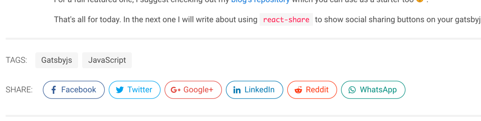

Let's talk about adding some cool social share buttons on [Gatsby](https://gatsbyjs.org) blog pages.
For this we will be using [react-share](https://github.com/nygardk/react-share).

### Install `react-share`

It is as simple as

```bash
yarn add react-share
```

### Modify configuration

Now we need to know about site's URL and a few other things for social sharing to work.
So let's edit our `gatsby-config.js` file and put the URL in the `siteMetadata`.

```js
module.exports = {
	siteMetadata: {
		// ...
		twitterHandle: '@swashata',
		url: 'https://swas.io',
		// other metadata
	},
	// ... other stuff, like plugin
};
```

### Create Social Component

Now let's create a [React Component](https://reactjs.org/docs/components-and-props.html)
which will show the share buttons. Creating a component instead of adding the code
directly is a great way to show share buttons where ever you like, for example,
archive pages, single pages etc.

Create a file `src/components/Share.jsx` and put the following code.

```jsx
import React from 'react';
import PropTypes from 'prop-types';
import { FontAwesomeIcon } from '@fortawesome/react-fontawesome';
import {
	FacebookShareButton,
	GooglePlusShareButton,
	LinkedinShareButton,
	TwitterShareButton,
	WhatsappShareButton,
	RedditShareButton,
} from 'react-share';

import './Share.scss';

const Share = ({ socialConfig, tags }) => (
	<div className="post-social">
		<FacebookShareButton
			url={socialConfig.config.url}
			className="button is-outlined is-rounded facebook"
		>
			<span className="icon">
				<FontAwesomeIcon icon={['fab', 'facebook-f']} />
			</span>
			<span className="text">Facebook</span>
		</FacebookShareButton>
		<TwitterShareButton
			url={socialConfig.config.url}
			className="button is-outlined is-rounded twitter"
			title={socialConfig.config.title}
			via={socialConfig.twitterHandle.split('@').join('')}
			hashtags={tags}
		>
			<span className="icon">
				<FontAwesomeIcon icon={['fab', 'twitter']} />
			</span>
			<span className="text">Twitter</span>
		</TwitterShareButton>
		<GooglePlusShareButton
			url={socialConfig.config.url}
			className="button is-outlined is-rounded googleplus"
		>
			<span className="icon">
				<FontAwesomeIcon icon={['fab', 'google-plus-g']} />
			</span>
			<span className="text">Google+</span>
		</GooglePlusShareButton>
		<LinkedinShareButton
			url={socialConfig.config.url}
			className="button is-outlined is-rounded linkedin"
			title={socialConfig.config.title}
		>
			<span className="icon">
				<FontAwesomeIcon icon={['fab', 'linkedin-in']} />
			</span>
			<span className="text">LinkedIn</span>
		</LinkedinShareButton>
		<RedditShareButton
			url={socialConfig.config.url}
			className="button is-outlined is-rounded reddit"
			title={socialConfig.config.title}
		>
			<span className="icon">
				<FontAwesomeIcon icon={['fab', 'reddit-alien']} />
			</span>
			<span className="text">Reddit</span>
		</RedditShareButton>
		<WhatsappShareButton
			url={socialConfig.config.url}
			className="button is-outlined is-rounded whatsapp"
			title={socialConfig.config.title}
		>
			<span className="icon">
				<FontAwesomeIcon icon={['fab', 'whatsapp']} />
			</span>
			<span className="text">WhatsApp</span>
		</WhatsappShareButton>
	</div>
);

Share.propTypes = {
	socialConfig: PropTypes.shape({
		twitterHandle: PropTypes.string.isRequired,
		config: PropTypes.shape({
			url: PropTypes.string.isRequired,
			title: PropTypes.string.isRequired,
		}),
	}).isRequired,
	tags: PropTypes.arrayOf(PropTypes.string),
};
Share.defaultProps = {
	tags: [],
};

export default Share;
```

Also create a `src/components/Share.scss` file and put the following.

```scss
$brand-colors: (
	facebook: #3b5998,
	twitter: #1da1f2,
	googleplus: #dd4b39,
	linkedin: #0077b5,
	reddit: #ff4500,
	whatsapp: #128c7e,
);

.post-social {
	.button {
		margin: 0.5rem 0.25rem;
		// transition: all 300ms ease-out;
		@each $class, $color in $brand-colors {
			&.#{$class} {
				color: $color;
				border-color: $color;
				&:hover {
					background-color: $color;
					border-color: $color;
					color: #fff;
				}
			}
		}
	}
}
```

PS: You do need the [gatsby-plugin-sass](https://www.gatsbyjs.org/packages/gatsby-plugin-sass/?=sass).

Of course edit to your liking. Here the component basically requires two props:

1.  `socialConfig`: An object of the mentioned shape to pass in our configuration
    data. We pass the common `url` and `title` inside `config` hash and a separate
    `twitterHandle` for twitter specific share.
2.  `tags`: Optional array of tags of the blog post. This is implementation specific.
    If you are not using any tags, then you can just leave it as is.

Also I am assuming you have some sort of [FontAwesome](https://github.com/FortAwesome/react-fontawesome) setup.

### Get data using graphql

Now depending on your setup, you need to edit the [template component](https://www.gatsbyjs.org/docs/building-with-components/#page-template-components)
for your single blog pages.

We need to insert the query for getting the `siteMetadata` we had inserted before.

In my case, I am going to edit `src/templates/blog-post.js`

```graphql
query BlogPostByID($id: String!) {
	site {
		siteMetadata {
			url
			twitterHandle
		}
	}
	post: markdownRemark(id: { eq: $id }) {
		id
		html
		frontmatter {
			title
			tags
		}
		fields {
			slug
		}
	}
}
```

Your mileage will vary here. I have assumed the following

1.  You are putting `title`, `tags` in the [frontmatter](https://jekyllrb.com/docs/frontmatter/).
2.  You are adding the `slug` field to nodes. It can be done by the following snippet
    put directly in `gatsby-node.js`. We will need the slug to calculate the share URL.

```js
const { createFilePath } = require('gatsby-source-filesystem');

exports.onCreateNode = ({ node, boundActionCreators, getNode }) => {
	const { createNodeField } = boundActionCreators;

	if (node.internal.type === `MarkdownRemark`) {
		const value = createFilePath({ node, getNode });
		createNodeField({
			name: `slug`,
			node,
			value,
		});
	}
};
```

A simple frontmatter may look like this.

```markdown
---
title: Social Share button for Gatsby Blog Pages
date: 2018-06-04T10:41:18.083Z
tags: ["Gatsbyjs","JavaScript","Social"]

---

Let's talk about adding some cool social share buttons on [Gatsby](https://gatsbyjs.org) blog pages.
```

### Use the data to add a `Share` component

Now that we have our data, let's add the share component we have created earlier.

In the same file (`src/templates/blog-post.js`), make modifications like this.

```jsx
import React from 'react';
import Share from '../components/Share';

const BlogPost = ({ data }) => {
	// destructure and get our variables
	const {
		post: {
			html,
			frontmatter: { title, tags },
			fields: { slug },
		},
		site: {
			siteMetadata: { url, twitterHandle },
		},
	} = data;
	return (
		<div className="blog-post">
			<h1 className="title is-1">{title}</h1>
			<div
				className="content"
				dangerouslySetInnerHTML={{ __html: html }}
			/>
			<Share
				socialConfig={{
					twitterHandle,
					config: {
						url: `${url}${slug}`,
						title,
					},
				}}
				tags={tags}
			/>
		</div>
	);
};
```

If done correctly, it will now show up below your post content.



### Quick Recap

So, to recap, we have implemented the social share button with the following
strategy.

1.  Pass in the site URL and twitterHandle through `gatsby-config.js` file.
2.  Pass post `title`, `tags` etc through frontmatter.
3.  Create a `slug` field on `MarkdownRemark` nodes.
4.  Use `graphql` to query our needed data.
5.  Pass the data to a custom component to create a set of sharing buttons.
6.  The custom components will use `react-share` to create the buttons.

That's all. Do comment and share if you like.
