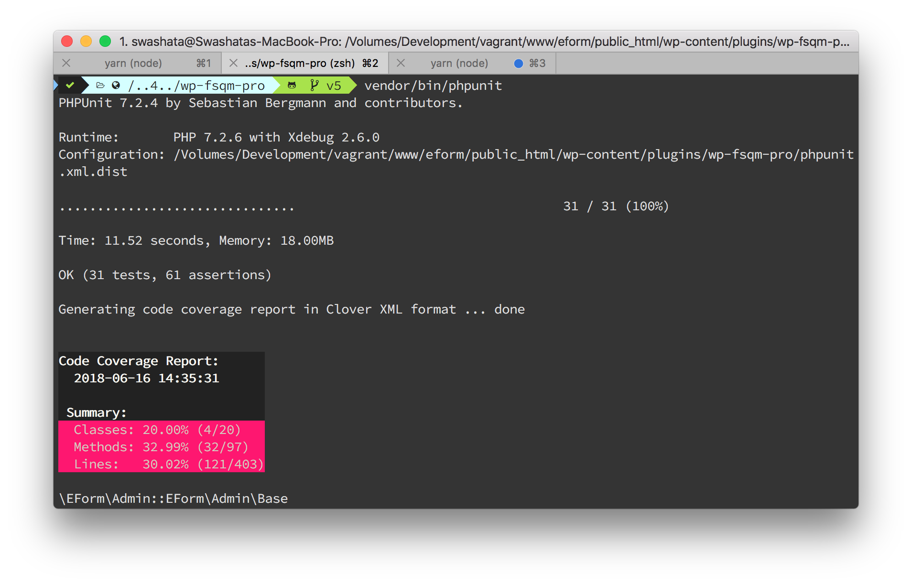

[](https://brain-wp.github.io/BrainMonkey/)

So I am almost completely rewriting the codebase of [EForm](https://eform.live)
Plugin. While doing so, I took the opportunity to rewrite the Unit tests and use
the latest [PHPUnit](https://phpunit.de/) (7.2).

The problem was, [official way of doing](https://make.wordpress.org/core/handbook/testing/automated-testing/phpunit/)
things does not (still) work with PHPUnit 7 and it loads all of WordPress and
does real database stuff. This results in Integration tests and not Unit tests.

I really hated that WordPress and database has to be running in order to test
my plugin which took some really long time to complete. A unit test should be
precise, shouldn't depend on external dependencies and run really fast.

With the above requirements in mind, I found two solutions.

1.  [Mockery](http://docs.mockery.io/en/latest/) - A great PHP mock object framework.
2.  [Patchwork2](http://patchwork2.org/) - Another great framework for monkey patching,
    which simply means redefining functions at runtime.

But it would take a lot of time to create another framework specifically
tuned for WordPress.

Luckily there exists two libraries which does the job really good.

1.  [Brain Monkey](https://github.com/Brain-WP/BrainMonkey) - A test utility for PHP & WordPress by Brain WP.
1.  [WP_Mock](https://github.com/10up/wp_mock) - An API mocking framework by 10up.

I started with WP_Mock but after getting stuck with a problem which had no solutions
opted for **Brain Monkey**, and boy was I amazed 😱.

It handled WordPress things, especially [Actions and Filters](https://codex.wordpress.org/Plugin_API)
really well, and I could focus on writing code and testing them.

## Install Brain Monkey

Assuming you are using [composer](https://getcomposer.org/) and [packagist](https://packagist.org/)
to manage dependencies, it is very easy to install Brain Monkey.

```bash
composer require --dev brain/monkey phpunit
```

The above command will install `BrainMonkey` and `PHPUnit` as your `devDependencies`.

## Setup Brain Monkey & PHPUnit

Now comes the fun part. Assuming, we are putting tests inside `tests/phpunit`,
let's first create the bootstrap file.

### #1: `bootstrap.php` Template

The following content should be placed under `tests/phpunit/bootstrap.php`.

```php
<?php
/**
 * The following snippets uses `PLUGIN` to prefix
 * the constants and class names. You should replace
 * it with something that matches your plugin name.
 */
// define test environment
define( 'PLUGIN_PHPUNIT', true );

// define fake ABSPATH
if ( ! defined( 'ABSPATH' ) ) {
	define( 'ABSPATH', sys_get_temp_dir() );
}
// define fake PLUGIN_ABSPATH
if ( ! defined( 'PLUGIN_ABSPATH' ) ) {
	define( 'PLUGIN_ABSPATH', sys_get_temp_dir() . '/wp-content/plugins/my-plugin/' );
}

require_once __DIR__ . '/../../vendor/autoload.php';

// Include the class for PluginTestCase
require_once __DIR__ . '/inc/PluginTestCase.php';

// Since our plugin files are loaded with composer, we should be good to go
```

Note that I have specifically defined `ABSPATH`, because in many cases, to protect
direct access to our files, we do something like

```php
if ( ! defined( 'ABSPATH' ) ) {
	die( '' );
}
```

which would cause our tests to fail silently.

Also since we are using composer, we have the part `require_once __DIR__ . '/../../vendor/autoload.php';`
You may want to change it accordingly.

Of course you need to change `Plugin` with a prefix of your actual plugin name.

### #2: `PluginTestCase.php` File for using Brain Monkey

Now we need to actually use Brain Monkey in our test files. It provides `traits`
to enhance our test classes. Instead of using them on all our test classes, we will
create a base class and extend it for writing tests.

Put the following content under `tests/phpunit/inc/PluginTestCase.php` file.

```php
<?php
use PHPUnit\Framework\TestCase;
use Mockery\Adapter\Phpunit\MockeryPHPUnitIntegration;
use Brain\Monkey;

/**
 * An abstraction over WP_Mock to do things fast
 * It also uses the snapshot trait
 */
class PluginTestCase extends \PHPUnit\Framework\TestCase {
	use MatchesSnapshots;
	use MockeryPHPUnitIntegration;

	/**
	 * Setup which calls \WP_Mock setup
	 *
	 * @return void
	 */
	public function setUp() {
		parent::setUp();
		Monkey\setUp();
		// A few common passthrough
		// 1. WordPress i18n functions
		Monkey\Functions\when( '__' )
			->returnArg( 1 );
		Monkey\Functions\when( '_e' )
			->returnArg( 1 );
		Monkey\Functions\when( '_n' )
			->returnArg( 1 );
	}

	/**
	 * Teardown which calls \WP_Mock tearDown
	 *
	 * @return void
	 */
	public function tearDown() {
		Monkey\tearDown();
		parent::tearDown();
	}
}
```

It does a few things to setup Brain Monkey.

1.  Extends PHPUnit `TestCase` class to provide easy inheritance.
2.  Calls `Monkey\setUp();` in test `setUp` Fixture.
3.  Calls `Monkey\tearDown();` in test `tearDown` Fixture.
4.  Uses `MockeryPHPUnitIntegration` to integrate Mockery (not to be confused with Brain Monkey) with PHPUnit.

These steps are needed to properly bootstrap PHPUnit.

### #3: `phpunit.xml` configuration

Now we need to tell PHPUnit to use our bootstrap file which loads all the frameworks.
To do that, we simply create a file `phpunit.xml` or `phpunit.xml.dist` file at
the root of the project (where `composer.json` is located). We put following
content inside it.

```xml
<?xml version="1.0" encoding="UTF-8"?>
<phpunit
	xmlns:xsi="http://www.w3.org/2001/XMLSchema-instance"
    xsi:noNamespaceSchemaLocation="https://schema.phpunit.de/7.2/phpunit.xsd"
	bootstrap="tests/phpunit/bootstrap.php"
	backupGlobals="true"
	colors="true"
	convertErrorsToExceptions="true"
	convertNoticesToExceptions="true"
	convertWarningsToExceptions="true"
	verbose="true"
	printerClass="PHPUnit\TextUI\ResultPrinter"
	>
	<testsuites>
		<testsuite name="EForm Test Suit">
			<directory suffix="Test.php">./tests/phpunit</directory>
		</testsuite>
	</testsuites>
	<filter>
		<whitelist processUncoveredFilesFromWhitelist="false">
			<directory suffix=".php">./inc</directory>
		</whitelist>
	</filter>
	<logging>
		<log type="coverage-text" target="php://stdout" showUncoveredFiles="true"/>
		<log type="coverage-clover" target="coverage/phpunit/clover.xml" showUncoveredFiles="true"/>
	</logging>
</phpunit>
```

The configuration above assumes that you have your source files under `inc` directory.
Change it accordingly.

## Writing Tests

Now we can write tests inside `tests/phpunit/testcases`. Here's a sample one.

```php
namespace PluginTest\Stuff;
use \Plugin\Stuff\SomeClass;
use \Brain\Monkey\Functions;

class SomeClassTest extends \PluginTestCase {
	public function test_construct() {
		// arrange
		$_SERVER['REQUEST_METHOD'] = 'POST';
		$_POST = [ 'foo' => '\\\'asas' ];
		// We expect wp_unslash to be called during bootstrap
		Functions\expect( 'wp_unslash' )
			->once()
			->with( $_POST )
			->andReturnFirstArg();
		// We expect plugins_url to be called
		Functions\expect( 'plugins_url' )
			->once()
			->with( '/dist/', PLUGIN_ABSPATH )
			->andReturn( 'https://eform.test/foo/dist/' );
		// Fire
		$stub = $this->getMockForAbstractClass( SomeClass::class );
		$stub_class = get_class( $stub );
		// $base = new \EFormStub\StubAdminBase();
		// We expect admin_menu action to have been added when calling register
		$this->assertTrue( has_action( 'admin_menu', "{$stub_class}->admin_menu()" ) );
		// Assert
		$this->assertEquals( $_POST, $stub->get_post() );
	}
}
```

I prefer to organize my tests under same directory structure inside `tests/phpunit/testcases`
as inside `inc`. Also I prefer to keep main plugin namespace under `Prefix` whereas
all my test classes reside under `PrefixTest` namespace.

Again I believe there isn't any right way to do such thing, so use your best judgement.

## Running Tests

From your project root, run

```bash
vendor/bin/phpunit
```

It will automatically pick your `phpunit.xml.dist` configuration and run all
tests defined under `tests/phpunit/testcases`.



We can also setup a composer script by adding the following snippet inside
`composer.json`.

```json
{
	"scripts": {
		"test": "phpunit"
	}
}
```

Now you can simply run

```bash
composer run-script test
```

and it will run the tests.

## Further Reading

I recommend going through the official documentations to learn how tests work.

1.  [Brain Monkey](https://brain-wp.github.io/BrainMonkey/) - Official Docs. Here where you should start.
2.  [Mockery](http://docs.mockery.io/en/latest/index.html) - You need to grasp the concepts of
    mockery to write useful stubs.
3.  [PHPUnit](https://phpunit.readthedocs.io/en/7.1/) - Just in case if you are exploring things 😉.

## Some Snippets

Here are some awesome snippets to quickly get you started.

### Mock WordPress Core Objects

In many cases, our code may have calls to WordPress objects, like `wpdb`, `WP_Query`,
`WP_Role` etc.

We can mock them with [Mockery](http://docs.mockery.io/en/latest/index.html).

Here I am showing you an example of calling `wp_roles` which in turn returns
`WP_Role` instance.

```php
use Brain\Monkey\Functions;

class SomeTest extends \PluginTestCase {
	public function test_something() {
		// Our code calls `wp_roles` so we mock it
		$wp_roles = \Mockery::mock( '\WP_Roles' );
		$wp_roles->shouldReceive( 'add_cap' )
			->times( 5 );
		Functions\expect( 'wp_roles' )
			->once()
			->withNoArgs()
			->andReturn( $wp_roles );
		// Act
		// Assume `create_cap` calls `wp_roles` in some way.
		// Then it calls `add_cap` 5 times.
		( new Some() )->create_cap();
	}
}
```

### Mock WordPress Core Functions

Just like objects, we can mock WordPress core functions, or any php function for
that matter using `Functions\when` and `Functions\expect` of Brain Monkey.

1.  Use `Functions\when` to just mock a function and maybe provide a passthrough (i.e, return an argument).
    The function doesn't need to be called.
2.  Use `Functions\expect` to set expectation against a function to have been called and
    verify arguments passed etc.

Here are a couple of examples.

```php
use Brain\Monkey\Functions;

class SomeTest extends \PluginTestCase {
	public function test_something() {
		// A simple mock for `plugins_url` to return a sample URL
		Functions\when( 'plugins_url' )
			->justReturn( 'https://plugin.com/wp-content/plugins/my-plugin/assets/thing.js' );
		// We expect our method to call `wp_enqueue_script` with specific handler and URL
		// returned by `plugins_url`.
		Functions\expect( 'wp_enqueue_script' )
			->once()
			->with( 'plugin-main-js', \Mockery::type( 'string' ), \Mockery::type( 'array' ), \Mockery::type( 'bool' ) )
			->andReturn( true );
		// act
		( new Some() )->enqueue();
	}
}
```

In the above example, we also saw usage of [`Mockery::type`](http://docs.mockery.io/en/latest/reference/argument_validation.html)
to validate arguments.

### Mock WordPress i18n functions

```php
use Brain\Monkey\Functions;

class SomeTest extends \PluginTestCase {
	public function test_something() {
		Functions\when( '__' )
			->returnArg( 1 );
		Functions\when( '_e' )
			->returnArg( 1 );
		Functions\when( '_n' )
			->returnArg( 1 );
	}
}
```

### Mock WordPress options API

If you just want to mock the options API, then following is fine.

```php
use Brain\Monkey\Functions;

class SomeTest extends \PluginTestCase {
	public function test_something() {
		// Mock add_option
		Functions\when( 'add_option' )->justReturn( true );
		// Mock update_option
		Functions\when( 'update_option' )->justReturn( true );
		// Mock get_option
		Functions\when( 'get_option' )->justReturn( true );
		// Mock delete_option
		Functions\when( 'delete_option' )->justReturn( true );
	}
}
```

But in most of the cases, we would like to make sure that our methods are calling
`get_option` with specific arguments. In this case, we will use `Functions\expect`.

```php
use Brain\Monkey\Functions;

class SomeTest extends \PluginTestCase {
	public function test_something() {
		// Expect get_option to have been called with something
		Functions\expect( 'get_option' )
			->once() // called once
			->with( 'plugin-settings', [] ) // with specified arguments, like get_option( 'plugin-settings', [] );
			->andReturn( [] ); // what it should return?
	}
}
```

---

So that's all about WordPress unit testing with Brain Monkey. I hope you like it.
If you need any help, just ask.
